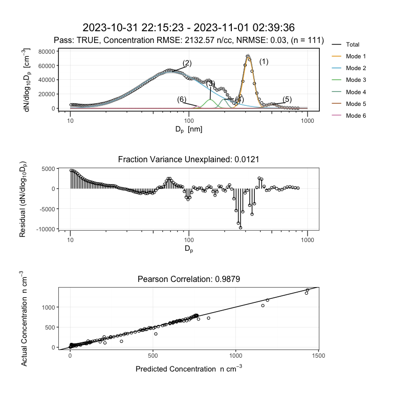
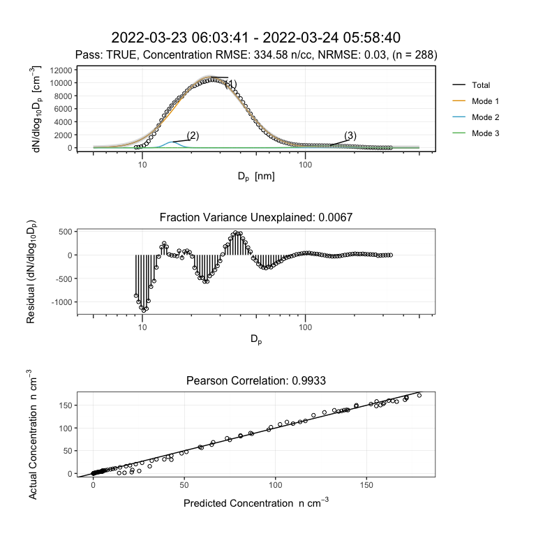
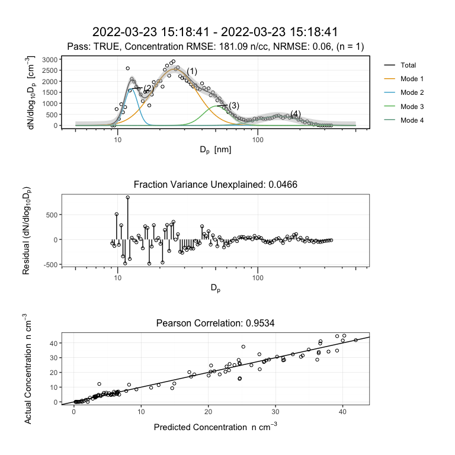
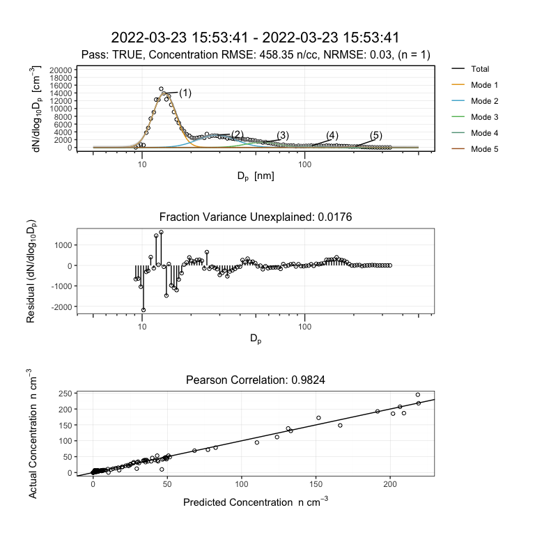

Curve fitting algorithm for multimodal particle size distributions – a
theoretical basis
================
2025-11-20


- [1 Setup](#1-setup)
  - [1.1 Retrieve Read Functions](#11-retrieve-read-functions)
  - [1.2 Import Libraries](#12-import-libraries)
  - [1.3 User Paths](#13-user-paths)
- [2. Formatting Data](#2-formatting-data)
  - [2.1 Brechtel Manufacturing Inc. (BMI)
    Data](#21-brechtel-manufacturing-inc-bmi-data)
  - [2.2 TSI Data](#22-tsi-data)
  - [2.3 netCDF Data](#23-netcdf-data)
  - [2.4 NASA-AMES Data](#24-nasa-ames-data)
- [3. Running multimodal](#3-running-multimodal)
  - [3.1 Example 1 - Laboratory Data](#31-example-1---laboratory-data)
    - [3.1.1 Outputs](#311-outputs)
  - [3.2 Example 2 - Storm Peak
    Laboratory](#32-example-2---storm-peak-laboratory)

------------------------------------------------------------------------

Christopher N. Rapp<sup>1</sup>, Sining Niu<sup>2</sup>, Yue
Zhang<sup>2</sup>, A. Gannet Hallar<sup>3</sup>, Fred J.
Brechtel<sup>4</sup>, and Daniel J. Cziczo<sup>1</sup>

<sup>1</sup>Department of Earth, Atmospheric, and Planetary Sciences,
Purdue University, West Lafayette, Indiana, 47906-2051, USA

<sup>2</sup>Department of Atmospheric Sciences, Texas A&M University,
College Station, Texas, 77843-3150, USA

<sup>3</sup>Department of Atmospheric Sciences, University of Utah, Salt
Lake City, Utah, 84112-0102, USA

<sup>4</sup>Brechtel Manufacturing Incorporated, Hayward, California,
94544, USA

*Correspondence to*: Christopher N. Rapp (christopherrapp@icloud.com)

------------------------------------------------------------------------

Source code for helper read functions are housed here
<a href="https://github.com/christopher-rapp/multimodal/tree/main/R"
class="uri">https://github.com/christopher-rapp/multimodal.git</a>

------------------------------------------------------------------------

# 1 Setup

## 1.1 Retrieve Read Functions

## 1.2 Import Libraries

``` r
library(stringr)
library(formatR)
library(data.table)
library(tidyr)
library(dplyr)
library(lubridate)
library(logr)
library(ggplot2)
library(purrr)
library(patchwork)
library(ncdf4)
```

## 1.3 User Paths

To download the example data for BMI and TSI visit. For NASA-AMES or
netCDF examples see linked sources below.

<https://github.com/christopher-rapp/multimodal/tree/main/data>

Define user paths such as ‘~/Library/Documents/multimodal/example/BMI/’

# 2. Formatting Data

Raw view of data format is appended to the bottom of this document

## 2.1 Brechtel Manufacturing Inc. (BMI) Data

``` r
BMI.data.ls <- readPSD_BMI(import.path.BMI, tz = "US/Eastern")

# Read functions export data as a list to account for
# multiple files in a directory
dataPSD.BMI <- BMI.data.ls[[1]]
```

## 2.2 TSI Data

Use example data from Storm Peak Laboratory for a new particle formation
event (NPF) on 2022-03-23.

``` r
TSI.data.ls <- readPSD_TSI(import.path.TSI, tz = "US/Mountain")

# Read functions export data as a list to account for
# multiple files in a directory
dataPSD.TSI <- TSI.data.ls[[1]]
```

## 2.3 netCDF Data

Data were obtained from the Atmospheric Radiation Measurement (ARM) User
Facility, a U.S. Department of Energy (DOE) Office of Science user
facility managed by the Biological and Environmental Research Program.

SGP SMPS data were obtained from the Atmospheric Radiation Measurement
(ARM) User Facility, a U.S. Department of Energy (DOE) Office of Science
user facility managed by the Biological and Environmental Research
Program.

Kuang, C., Singh, A., Howie, J., Salwen, C., & Hayes, C. Scanning
mobility particle sizer (AOSSMPS), 2016-11-15 to 2025-06-23, Southern
Great Plains (SGP), Lamont, OK (Extended and Co-located with C1) (E13).
Atmospheric Radiation Measurement (ARM) User
Facility. [https://doi.org/10.5439/1476898](https://nam04.safelinks.protection.outlook.com/?url=https%3A%2F%2Fdoi.org%2F10.5439%2F1476898&data=05%7C02%7Crapp5%40purdue.edu%7C3169aa02ccec49c7f95308ddb347fdca%7C4130bd397c53419cb1e58758d6d63f21%7C0%7C0%7C638863843967247118%7CUnknown%7CTWFpbGZsb3d8eyJFbXB0eU1hcGkiOnRydWUsIlYiOiIwLjAuMDAwMCIsIlAiOiJXaW4zMiIsIkFOIjoiTWFpbCIsIldUIjoyfQ%3D%3D%7C0%7C%7C%7C&sdata=ALFii3068kvIqc5dG4sN68sjbu3pqHGaYbM90rr5aFM%3D&reserved=0)

Similarly for the BMI and TSI data, define the import.path of downloaded
NC

``` r
NC.data.ls <- readPSD_NC(import.path.NC)

# Read functions export data as a list to account for
# multiple files in a directory
dataPSD.NC <- NC.data.ls[[1]]
```

## 2.4 NASA-AMES Data

Data obtained from
<https://ebas-data.nilu.no/DataSets.aspx?stations=US9050R&InstrumentTypes=smps&fromDate=1970-01-01&toDate=2025-12-31>.

The EBAS database has largely been funded by the UN-ECE CLRTAP (EMEP),
AMAP and through NILU internal resources. Specific developments have
been possible due to projects like EUSAAR (EU-FP5)(EBAS web interface),
EBAS-Online (Norwegian Research Council INFRA) (upgrading of database
platform) and HTAP (European Commission DG-ENV)(import and export
routines to build a secondary repository in support
of [**www.htap.org**](http://www.htap.org/)). A large number of specific
projects have supported development of data and meta data reporting
schemes in dialog with data providers (EU)(CREATE, ACTRIS and others). 

``` r
NAS.data.ls <- readPSD_NAS(import.path.NAS)

# Read functions export data as a list to account for
# multiple files in a directory
dataPSD.NAS <- NAS.data.ls[[1]]
```

# 3. Running multimodal

Let’s run multimodal on an example dataset using a Brechtel SEMS (Model
2002). Note the log path will need to be changed to whatever location
you’d like it sent to!

## 3.1 Example 1 - Laboratory Data

``` r
# Frequency is null here because I already grouped data
# above I've also removed the argument for the log.path
# which will default to a temporary directory created by R
# which is deleted upon exiting an R session
result <- multimodal.fitting(dataPSD.BMI, log.path, frequency = NULL,
    labeling = T, max.iterations = 30, max.modes = 6, smoothing = F,
    lower.limit = 10, upper.limit = 1500, NMRSE.threshold = 0.05,
    FVU.threshold = 5, FVU.tolerance = 0.1, verbose = T)
```

    ## [1] "Log Path: ~/Library/CloudStorage/Box-Box/Multimodal Curve Fitting/log//multimodal20231031181523_20251121102643.log"
    ## [1] "Current Dataset Time: 2023-10-31 22:15:23 UTC"
    ## [1] "Dataset sampling frequency is 2.4 min"
    ## [1] "2023-10-31 22:15:23: Current Loop: 1, Remaining Variance: 94.93%, # of Modes: 1"
    ## [1] "2023-10-31 22:15:23: Current Loop: 2, Remaining Variance: 3.93%, # of Modes: 2"
    ## [1] "2023-10-31 22:15:23: Current Loop: 3, Remaining Variance: 2.57%, # of Modes: 3"
    ## [1] "2023-10-31 22:15:23: Current Loop: 4, Remaining Variance: 1.63%, # of Modes: 4"
    ## [1] "2023-10-31 22:15:23: Current Loop: 5, Remaining Variance: 1.34%, # of Modes: 5"
    ## [1] "2023-10-31 22:15:23: Current Loop: 6, Remaining Variance: 1.3%, # of Modes: 6"
    ## [1] "Concentration RMSE: 2132.57 n/cc"

``` r
# As there is only 1 data file for this set, we will
# flatten the list
result <- flatten(result)
```

### 3.1.1 Outputs

The first element of result is a pass flag i.e. T or F

``` r
result$pass
```

    ## [1] TRUE

The second is the plot which consists of three panels



**Figure S1** - An example of how to use the multimodal algorithm on
example laboratory data. Note this reproduces the full version of Figure
2 in the manuscript.

The remaining outputs are data.frames of the combined actual/predicted
data (Table S1), the data used to plot curves (Table S2), lognormal
parameters of the modes (Table S3), and text output of the evaluation
parameters.

**Table S1** - Actual and predicted data for each diameter. Here we only
present the first 6 rows of data for brevity. Note units and proper
notation are missing due to restrictions for data.frame objects. From
left to right: particle diameter (nm), predicted concentration
(dN/dlogDp), predicted number concentration (n cm-3), actual measurment
concentration (dN/dlogDp), actual number concentration (n cm-3),
residual particle concentration (dN/dlogDp), residual number
concentration (n cm-3), and ratio of actual to predicted concentration
for each bin.

| Dp | Predicted dNdlogDp | Predicted dN | Actual dNdlogDp | Actual dN | Residual dNdlogDp | Residual dN | Ratio |
|---:|---:|---:|---:|---:|---:|---:|---:|
| 10.16 | 453.91 | 6.30 | 4952.51 | 68.75 | 4498.60 | 62.45 | 0.09 |
| 10.49 | 529.09 | 7.12 | 4985.42 | 67.06 | 4456.33 | 59.95 | 0.11 |
| 10.82 | 612.31 | 8.47 | 4903.32 | 67.79 | 4291.01 | 59.33 | 0.12 |
| 11.17 | 709.75 | 9.78 | 4740.17 | 65.30 | 4030.42 | 55.52 | 0.15 |
| 11.53 | 820.21 | 11.25 | 4507.12 | 61.83 | 3686.91 | 50.58 | 0.18 |
| 11.90 | 944.94 | 12.90 | 4250.88 | 58.03 | 3305.94 | 45.13 | 0.22 |

**Table S2 -** Predicted concentration (dN/dlogD<sub>p</sub>) for each
identified mode to plot fitted modes. From left to right: particle
diameter (nm), modes 1-6 concentration (dN/dlogD<sub>p</sub>), and total
concentration in (dN/dlogD<sub>p</sub>).

|    Dp | Mode 1 | Mode 2 | Mode 3 | Mode 4 | Mode 5 | Mode 6 | dNdlogDp |
|------:|-------:|-------:|-------:|-------:|-------:|-------:|---------:|
| 10.00 |      0 | 420.26 |      0 |      0 |      0 |      0 |   420.26 |
| 10.01 |      0 | 422.31 |      0 |      0 |      0 |      0 |   422.31 |
| 10.02 |      0 | 424.37 |      0 |      0 |      0 |      0 |   424.37 |
| 10.03 |      0 | 426.43 |      0 |      0 |      0 |      0 |   426.43 |
| 10.04 |      0 | 428.50 |      0 |      0 |      0 |      0 |   428.50 |
| 10.05 |      0 | 430.58 |      0 |      0 |      0 |      0 |   430.58 |

**Table S3 -** Lognormal parameter output. From left to right: mode
label, total number concentration (n cm<sup>-3</sup>), geometric
standard deviation, geometric mean diameter (nm), maximum measured
concentration for identified peak (dN/dlogD<sub>p</sub>), lower peak
diameter limit (nm), diameter of peak (nm), upper peak diameter limit
(nm), width of identified peak in bins, Bayesian Information Criterion
of model, residual sum of squares, total sum of squares, coefficient of
correlation, and Student’s t-test p-values for mode parameters. Note
rounding is not applied by default. Notation is limited by data.frame
formatting.

| Mode Label |     N |  GSD |   Dpg |   Max | Lower |  Mode | Upper | Width |
|:-----------|------:|-----:|------:|------:|------:|------:|------:|------:|
| Mode 1     |  7710 | 1.10 | 318.0 | 72800 | 250.0 | 311.0 |   452 |    13 |
| Mode 2     | 35200 | 1.89 |  71.6 | 53300 |  13.5 |  69.2 |   106 |    62 |
| Mode 3     |  1300 | 1.10 | 151.0 | 12500 | 127.0 | 148.0 |   173 |     8 |
| Mode 4     |   907 | 1.07 | 196.0 | 12100 | 166.0 | 195.0 |   272 |    12 |
| Mode 5     |   715 | 1.13 | 499.0 |  5630 | 430.0 | 498.0 |   831 |    13 |
| Mode 6     |   141 | 1.04 | 117.0 |  2930 |  98.3 | 118.0 |   137 |     9 |

|  BIC |      RSS |      TSS |    R2 | N T pval | GSD T pval | Dpg T pval |
|-----:|---------:|---------:|------:|---------:|-----------:|-----------:|
|  277 | 1.50e+08 | 8.17e+09 | 0.982 |    0e+00 |          0 |          0 |
| 1090 | 8.86e+07 | 2.00e+10 | 0.996 |    0e+00 |          0 |          0 |
|  153 | 4.78e+06 | 9.37e+07 | 0.949 |    8e-07 |          0 |          0 |
|  263 | 2.10e+08 | 6.18e+08 | 0.660 |    4e-03 |          0 |          0 |
|  212 | 1.49e+06 | 5.30e+07 | 0.972 |    0e+00 |          0 |          0 |
|  179 | 1.39e+07 | 3.29e+07 | 0.576 |    4e-02 |          0 |          0 |

**Table S4** - Statistical evaluation of the summed mode fits compared
to the actual measurement. Pearson correlation coefficient, root mean
square error of concentration (dN/dlogD<sub>p</sub>) , max-min
normalized root mean square error concentration (dN/dlogD<sub>p</sub>),
root mean square error of number concentration (n cm<sup>-3</sup>) ,
max-min normalized root mean square error of number concentration (n
cm<sup>-3</sup>) , output of Student’s t-test, and Chi-squared
goodness-of-fit. Note as mentioned in the article, significance or
goodness-of-fit testing did not demonstrate effectiveness in evaluating
the model performance.

| Pearson Correlation |    RMSE | NRMSE | dN RMSE | dN NRMSE | Students T Test | Chi-Squared |
|--------------------:|--------:|------:|--------:|---------:|----------------:|------------:|
|                0.99 | 2132.57 |  0.03 |   37.15 |     0.03 |            0.85 |        0.24 |

## 3.2 Example 2 - Storm Peak Laboratory

    ## [1] "2022-03-23 06:03:41: Error, please modify lower and upper limits to accommadate data set"

Notice the failure message? This is because the dataset begins for bin
diameter 9.14. Now we can retry with adjusted limits.



**Figure S2** - Example of applying the multimodal.fitting function to a
day of SPL averaged from 6AM to 6 PM. Note with the high averaging time
a small peak appears where NPF events skew the average distribution
between 10 - 20 nm.

Within this example TSI file for SPL there is a NPF event, but currently
the averaging across the entire day removes all temporal variation. We
will instead select times between 10:00 and 11:00 local time where the
NPF event is just beginning and use high frequency data with smoothing
to account for noise. We will only show two examples.

For the hour of data, 9 of the 12 fittings for the beginning of the NPF
event (75% were successful) (i.e. explained 90% of concentration
variance and had a NRMSE of 0.1).



**Figure S3** - Example of applying the multimodal.fitting function to a
5-minute scan of a particle size distribution collected at SPL for the
time 2022-03-23 15:20:00 UTC. This is just prior to an NPF event.



**Figure S4** - Example of applying the multimodal.fitting function to a
5-minute scan of a particle size distribution collected at SPL for the
time 2022-03-23 15:55:00 UTC. This is during an NPF event.
